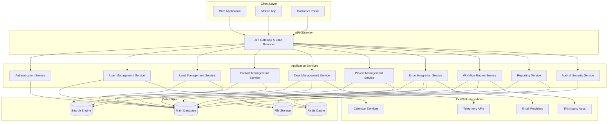
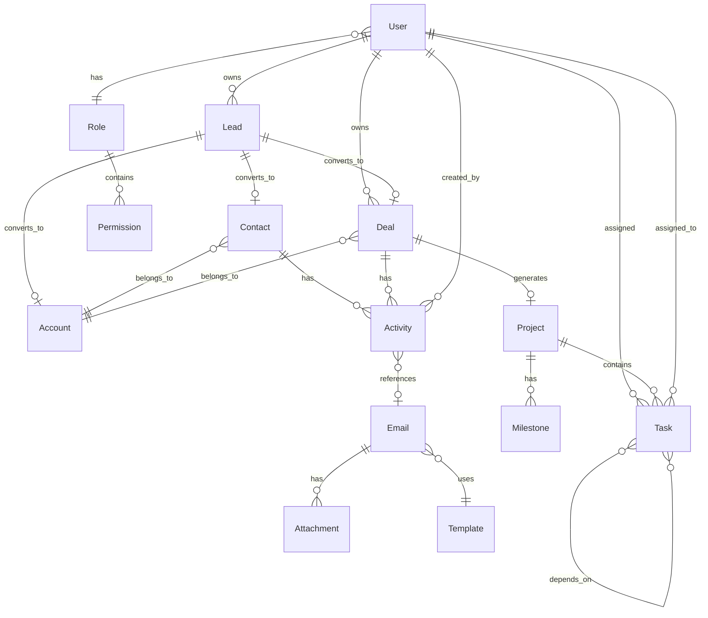

# CRM System Design Document

## Overview

The CRM system will be built as a modern web application using a microservices architecture to ensure scalability, maintainability, and security. The system will support role-based access control, real-time notifications, and seamless integrations with third-party services. The architecture follows domain-driven design principles with clear separation of concerns between customer management, sales pipeline, project management, and system administration.

## Architecture

### High-Level Architecture



### Technology Stack

- **Frontend**: React.js with TypeScript, Material-UI for consistent design
- **Backend**: Node.js with Express.js and TypeScript
- **Database**: Supabase (PostgreSQL) for relational data with built-in real-time subscriptions
- **Authentication**: Clerk for user authentication and session management
- **File Storage**: Supabase Storage for file uploads and attachments
- **Search**: Supabase full-text search capabilities
- **Real-time**: Supabase real-time subscriptions for live updates
- **Edge Functions**: Supabase Edge Functions for serverless backend logic
- **Monitoring**: Supabase built-in analytics and logging

## Components and Interfaces

### Core Domain Models

#### User Management Domain
- **User Entity**: Stores user profiles, roles, and authentication data
- **Role Entity**: Defines permission sets and access levels
- **Team Entity**: Groups users for hierarchical access control
- **Session Entity**: Manages active user sessions and security tokens

#### Customer Relationship Domain
- **Lead Entity**: Captures potential customer information and source tracking
- **Contact Entity**: Stores individual customer profiles and communication history
- **Account Entity**: Represents customer organizations with multiple contacts
- **Activity Entity**: Logs all interactions, calls, emails, and meetings

#### Sales Pipeline Domain
- **Deal Entity**: Tracks opportunities with stages, values, and probabilities
- **Pipeline Entity**: Defines sales process stages and conversion criteria
- **Forecast Entity**: Calculates revenue projections and sales metrics
- **Quote Entity**: Manages pricing proposals and contract terms

#### Project Management Domain
- **Project Entity**: Links to accounts/deals with timelines and deliverables
- **Task Entity**: Individual work items with assignments and dependencies
- **Milestone Entity**: Key project checkpoints with success criteria
- **Resource Entity**: Team member allocation and capacity planning

#### Communication Domain
- **Email Entity**: Stores email communications with threading and attachments
- **Template Entity**: Reusable email and document templates
- **Campaign Entity**: Marketing automation and bulk communication tracking
- **Notification Entity**: System alerts and user notifications

### API Interface Design

#### Authentication & Authorization
```typescript
interface AuthAPI {
  login(credentials: LoginRequest): Promise<AuthResponse>
  refreshToken(token: string): Promise<AuthResponse>
  logout(sessionId: string): Promise<void>
  validatePermission(userId: string, resource: string, action: string): Promise<boolean>
}
```

#### Lead Management
```typescript
interface LeadAPI {
  createLead(lead: CreateLeadRequest): Promise<Lead>
  updateLead(id: string, updates: UpdateLeadRequest): Promise<Lead>
  convertLead(id: string, conversion: ConversionRequest): Promise<ConversionResult>
  assignLead(id: string, assigneeId: string): Promise<void>
  searchLeads(criteria: SearchCriteria): Promise<PaginatedResult<Lead>>
}
```

#### Deal Management
```typescript
interface DealAPI {
  createDeal(deal: CreateDealRequest): Promise<Deal>
  updateDealStage(id: string, stage: string, notes?: string): Promise<Deal>
  calculateForecast(filters: ForecastFilters): Promise<ForecastData>
  getDealHistory(id: string): Promise<DealActivity[]>
  bulkUpdateDeals(updates: BulkUpdateRequest): Promise<BulkUpdateResult>
}
```

#### Project Management
```typescript
interface ProjectAPI {
  createProject(project: CreateProjectRequest): Promise<Project>
  updateTaskStatus(taskId: string, status: TaskStatus): Promise<Task>
  getProjectTimeline(projectId: string): Promise<TimelineData>
  assignResource(taskId: string, userId: string, allocation: number): Promise<void>
  generateGanttChart(projectId: string): Promise<GanttData>
}
```

## Data Models

### Core Entity Relationships



### Database Schema Design

#### Users and Roles
```sql
CREATE TABLE users (
    id UUID PRIMARY KEY DEFAULT gen_random_uuid(),
    email VARCHAR(255) UNIQUE NOT NULL,
    password_hash VARCHAR(255) NOT NULL,
    first_name VARCHAR(100) NOT NULL,
    last_name VARCHAR(100) NOT NULL,
    role_id UUID REFERENCES roles(id),
    team_id UUID REFERENCES teams(id),
    is_active BOOLEAN DEFAULT true,
    last_login TIMESTAMP,
    created_at TIMESTAMP DEFAULT CURRENT_TIMESTAMP,
    updated_at TIMESTAMP DEFAULT CURRENT_TIMESTAMP
);

CREATE TABLE roles (
    id UUID PRIMARY KEY DEFAULT gen_random_uuid(),
    name VARCHAR(50) UNIQUE NOT NULL,
    description TEXT,
    permissions JSONB NOT NULL,
    created_at TIMESTAMP DEFAULT CURRENT_TIMESTAMP
);
```

#### Customer Data
```sql
CREATE TABLE leads (
    id UUID PRIMARY KEY DEFAULT gen_random_uuid(),
    email VARCHAR(255),
    first_name VARCHAR(100),
    last_name VARCHAR(100),
    company VARCHAR(255),
    phone VARCHAR(50),
    source VARCHAR(100),
    status VARCHAR(50) DEFAULT 'new',
    score INTEGER DEFAULT 0,
    owner_id UUID REFERENCES users(id),
    created_at TIMESTAMP DEFAULT CURRENT_TIMESTAMP,
    updated_at TIMESTAMP DEFAULT CURRENT_TIMESTAMP
);

CREATE TABLE accounts (
    id UUID PRIMARY KEY DEFAULT gen_random_uuid(),
    name VARCHAR(255) NOT NULL,
    industry VARCHAR(100),
    website VARCHAR(255),
    phone VARCHAR(50),
    billing_address JSONB,
    shipping_address JSONB,
    owner_id UUID REFERENCES users(id),
    created_at TIMESTAMP DEFAULT CURRENT_TIMESTAMP,
    updated_at TIMESTAMP DEFAULT CURRENT_TIMESTAMP
);

CREATE TABLE contacts (
    id UUID PRIMARY KEY DEFAULT gen_random_uuid(),
    account_id UUID REFERENCES accounts(id),
    email VARCHAR(255),
    first_name VARCHAR(100) NOT NULL,
    last_name VARCHAR(100) NOT NULL,
    title VARCHAR(100),
    phone VARCHAR(50),
    mobile VARCHAR(50),
    is_primary BOOLEAN DEFAULT false,
    owner_id UUID REFERENCES users(id),
    created_at TIMESTAMP DEFAULT CURRENT_TIMESTAMP,
    updated_at TIMESTAMP DEFAULT CURRENT_TIMESTAMP
);
```

#### Sales Pipeline
```sql
CREATE TABLE deals (
    id UUID PRIMARY KEY DEFAULT gen_random_uuid(),
    name VARCHAR(255) NOT NULL,
    account_id UUID REFERENCES accounts(id),
    contact_id UUID REFERENCES contacts(id),
    amount DECIMAL(15,2),
    currency VARCHAR(3) DEFAULT 'USD',
    stage VARCHAR(50) NOT NULL,
    probability INTEGER DEFAULT 0,
    expected_close_date DATE,
    actual_close_date DATE,
    owner_id UUID REFERENCES users(id),
    created_at TIMESTAMP DEFAULT CURRENT_TIMESTAMP,
    updated_at TIMESTAMP DEFAULT CURRENT_TIMESTAMP
);

CREATE TABLE activities (
    id UUID PRIMARY KEY DEFAULT gen_random_uuid(),
    type VARCHAR(50) NOT NULL, -- call, email, meeting, task
    subject VARCHAR(255) NOT NULL,
    description TEXT,
    due_date TIMESTAMP,
    completed_at TIMESTAMP,
    related_to_type VARCHAR(50), -- lead, contact, deal, project
    related_to_id UUID,
    owner_id UUID REFERENCES users(id),
    created_at TIMESTAMP DEFAULT CURRENT_TIMESTAMP
);
```

## Error Handling

### Error Response Format
```typescript
interface ErrorResponse {
  error: {
    code: string
    message: string
    details?: any
    timestamp: string
    requestId: string
  }
}
```

### Error Categories
- **Authentication Errors** (401): Invalid credentials, expired tokens
- **Authorization Errors** (403): Insufficient permissions, role restrictions
- **Validation Errors** (400): Invalid input data, missing required fields
- **Business Logic Errors** (422): Duplicate records, invalid state transitions
- **System Errors** (500): Database failures, external service unavailability

### Error Handling Strategy
1. **Input Validation**: Validate all inputs at API boundaries using schema validation
2. **Business Rule Validation**: Enforce business constraints at the service layer
3. **Graceful Degradation**: Provide fallback functionality when external services fail
4. **Error Logging**: Log all errors with context for debugging and monitoring
5. **User-Friendly Messages**: Return meaningful error messages without exposing system internals

## Testing Strategy

### Testing Pyramid

#### Unit Tests (70%)
- **Service Layer**: Test business logic and data transformations
- **Repository Layer**: Test data access patterns and query logic
- **Utility Functions**: Test helper functions and validation logic
- **Coverage Target**: 90% code coverage for critical business logic

#### Integration Tests (20%)
- **API Endpoints**: Test complete request/response cycles
- **Database Operations**: Test data persistence and retrieval
- **External Integrations**: Test third-party service interactions with mocks
- **Authentication Flow**: Test login, token refresh, and permission validation

#### End-to-End Tests (10%)
- **User Workflows**: Test complete user journeys from login to task completion
- **Cross-Service Communication**: Test microservice interactions
- **Performance Testing**: Test system behavior under load
- **Security Testing**: Test authentication, authorization, and data protection

### Test Data Management
- **Test Database**: Separate database instance for testing with seed data
- **Mock Services**: Mock external APIs for consistent testing
- **Data Factories**: Generate test data with realistic relationships
- **Cleanup Strategy**: Automatic test data cleanup after test execution

### Continuous Testing
- **Pre-commit Hooks**: Run unit tests and linting before code commits
- **CI/CD Pipeline**: Automated testing on pull requests and deployments
- **Performance Monitoring**: Continuous monitoring of API response times
- **Security Scanning**: Automated vulnerability scanning of dependencies